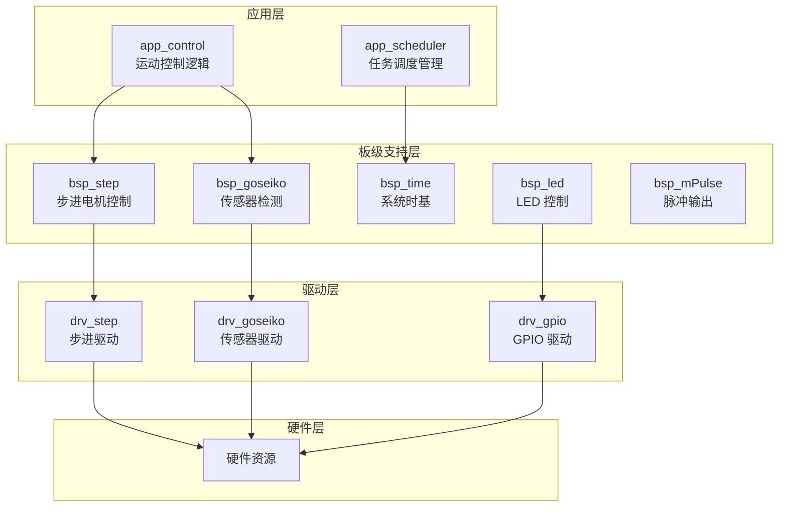

# StepPulse - 步进电机追剪飞剪控制系统

[!\[License: MIT\](https://img.shields.io/badge/License-MIT-yellow.svg null)](https://opensource.org/licenses/MIT)
[!\[Platform: AT32F403\](https://img.shields.io/badge/Platform-AT32F403-blue.svg null)](https://www.arterytek.com/en/products/AT32F403xx)
[!\[Language: C\](https://img.shields.io/badge/Language-C-green.svg null)](https://en.wikipedia.org/wiki/C_\(programming_language\))

> 基于 AT32F403 (240MHz) 的高性能双轴步进同步控制系统
> 实现 **追剪 + 飞剪 + 主轴同步 + 多产品连续处理**

## 项目简介

StepPulse 是一个专为工业自动化设计的步进电机控制系统，主要用于金属材料的追剪和飞剪加工。系统基于 AT32F403ARGT7 微控制器，通过精确的时序控制和误差补偿算法，实现高速、高精度的同步切割功能。

### 主要特性

- **双轴同步控制**：追剪轴（step3）和飞剪轴（step2）协同工作
- **高精度误差补偿**：通过实时计算主轴与追剪轴的位置偏差，实现精确切割
- **多产品连续处理**：采用队列机制，支持连续进料的产品加工
- **硬件加速**：使用 DMA 传输实现高频率脉冲输出，减少 CPU 占用
- **模块化设计**：分层架构，易于维护和扩展

## 硬件资源

### 引脚分配

**AT32F403ARGT7 240MHZ**

| 引脚             | 功能              | 说明                          |
| -------------- | --------------- | --------------------------- |
| GPIOB\_PIN\_3  | LED 控制          | 推挽输出                        |
| GPIOA\_PIN\_3  | 追剪步进电机方向控制      | 推挽输出                        |
| GPIOA\_PIN\_0  | 主轴步进电机 PWM 控制   | TIM8 中断，普通 IO 翻转            |
| GPIOA\_PIN\_1  | 飞剪步进电机 PWM 控制   | 连接 TMR2\_CH2                |
| GPIOA\_PIN\_2  | 追剪步进电机 PWM 控制   | 连接 TMR5\_CH3                |
| GPIOA\_PIN\_6  | Goseiko 金属传感器输入 | 带内部上拉                       |
| GPIOA\_PIN\_11 | Goseiko 金属传感器输入 | 带内部上拉                       |
| GPIOC\_PIN\_9  | Goseiko 金属传感器输入 | 带内部上拉                       |
| GPIOB\_PIN\_5  | 脉冲输出            | 连接 TIM3\_CH2，用于脉冲 mPulse 生成 |
| DMA1\_CHANNEL6 | DMA 通道          | 用于步进电机脉冲传输                  |
| DMA1\_CHANNEL7 | DMA 通道          | 用于步进电机脉冲传输                  |

### 传感器配置

| 传感器 | 触发方式 | 作用   |
| --- | ---- | ---- |
| X1  | 下降沿  | 启动追赶 |
| X2  | 上升沿  | 停止同步 |
| X3  | 下降沿  | 飞轴到位 |

## 软件架构

### 分层设计



### 核心运行机制

#### 主循环架构

```c
while(1)
{
    scheduler_run();      // 低周期任务调度
    os_step_move_scan();  // 步进状态扫描
    os_step_move_ctrl();  // 步进控制
}
```

#### 时间基准系统

- **1ms 系统节拍（TMR1）**：
  ```c
  systick_ms++;           // 系统 systick
  Master_Pulse_Counter += 4;  // 主轴脉冲累计 4 即 4kHz
  ```
- **主轴脉冲（TMR8）**：
  ```c
  8kHz 中断 → 翻转 GPIO → 4kHz 方波
  ```

## 核心功能

### 追剪控制（step3）

1. **回零过程**：系统启动时执行 `STEP3_HOMING → STEP3_HOMING_RESET → STEP3_IDLE`，完成初始位置校准
2. **同步过程**：X1 传感器触发后，进入 `STEP3_SYNC` 状态，以主轴速度运动追赶产品
3. **误差补偿**：X2 传感器触发后，计算位置偏差并进行精确修正
4. **循环运行**：完成一次追剪后，进入 `SYNC → RESET → IDLE` 循环，等待下一个产品

### 飞剪控制（step2）

1. **任务队列**：每次 X1 触发时，将产品进入时间存入队列
2. **启动判断**：当产品到达切割位置时，启动飞剪动作
3. **切割动作**：执行 3800 个脉冲的切割动作
4. **完成返回**：切割完成后，返回初始位置等待下一次任务

### 误差补偿算法

```c
uint32_t master_offset = (Master_Pulse_Counter - s1_trigger_pulse_val);
uint32_t slaver_offset = (uint32_t)((Master_Pulse_Counter - step3_return_Counter) * (STEP3_SPEED / (float)MAIN_STEP_SPEED));
uint32_t return_dist = RESET_STEPS - master_offset - slaver_offset;
return_dist = (uint32_t)((uint64_t)return_dist * STEP3_SPEED / (STEP3_SPEED + MAIN_STEP_SPEED));
```

## 工作流程

1. **系统上电 → 回零**
2. **等待产品进入**
3. **X1 触发**
   - 记录位置
   - step3 开始追剪
   - step2 入队
4. **step3 同步运动**
5. **X2 触发 → 停止并计算误差**
6. **step3 回位修正**
7. **主轴继续走**
8. **达到 WAIT\_PULSE → 启动 step2**
9. **step2 完成切割**
10. **系统继续处理下一个产品**

## 开发环境

- **IDE**：Keil MDK&#x20;
- **编译器**：ARMCC / GCC
- **目标芯片**：AT32F403ARGT7
- **时钟频率**：240MHz

## 安装与使用

1. **克隆仓库**
   ```bash
   git clone https://github.com/yourusername/StepPulse.git
   ```
2. **打开项目**
   - 使用 Keil MDK 打开项目文件
   - 或使用 STM32CubeIDE 导入项目
3. **配置参数**
   - 根据实际硬件调整引脚定义
   - 根据加工需求调整 `WAIT_PULSE` 等参数
4. **编译与烧录**
   - 编译项目生成固件
   - 使用烧录工具将固件写入 AT32F403A 芯片

## 关键参数调整

| 参数                | 说明        | 建议值        |
| ----------------- | --------- | ---------- |
| `MAIN_STEP_SPEED` | 主轴步进速度    | 根据实际电机性能调整 |
| `STEP2_SPEED`     | 飞剪轴步进速度   | 根据实际电机性能调整 |
| `STEP3_SPEED`     | 追剪轴步进速度   | 根据实际电机性能调整 |
| `RESET_STEPS`     | 复位步数      | 根据机械结构调整   |
| `WAIT_PULSE`      | 飞剪启动等待脉冲数 | 根据进料速度调整   |

## 故障排查

| 问题       | 可能原因             | 解决方案             |
| -------- | ---------------- | ---------------- |
| 追剪不同步    | 传感器触发时机错误        | 调整传感器位置          |
| 飞剪切割位置偏差 | WAIT\_PULSE 设置不当 | 调整 WAIT\_PULSE 值 |
| 步进电机失步   | 速度设置过高           | 降低步进速度           |
| 系统无响应    | 传感器接线错误          | 检查传感器接线          |

## 许可证

本项目采用 MIT 许可证，详情请查看 [LICENSE](LICENSE) 文件。

## 贡献

欢迎提交 Issue 和 Pull Request 来改进这个项目。

## 联系方式

- 作者：Z1R343L
- 邮箱：19816013818\@163.com

***

**注意**：本项目为工业控制系统，使用时请确保遵守相关安全规范，避免发生意外。
